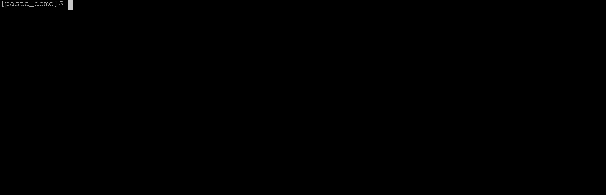

# Pasta 🍝    

<p align="center">Copy files between repositories without pain.</p>

<p align="center"></p>


## About

Pasta is a tool that allows copying files between repositories in a robust way:
Specify a list of sources in `pasta.yaml`, run `pasta`, and keep your sanity.


<p align="center"></p>

You can use it as a more predictable alternative to [git submodules](https://git-scm.com/book/en/v2/Git-Tools-Submodules), or [easily extended it](#contribute) to support other sources, such as Gitlab, Google Drive, or FTP servers.


## Installation

The easiest way to install pasta is to [install go](https://go.dev/doc/install), then do `go install github.com/audiotool/pasta@latest`.

Make sure you have `$(go env GOPATH)/bin` in your `PATH` variable, and invoke pasta with with `pasta`.

Alternatively, download a binary from the [releases page](https://github.com/audiotool/pasta/releases), and install it manually.

## `pasta.yaml` 

The following is an example `pasta.yaml`, making pasta:
* copying from:
  * repo `https://github.com/audiotool/manual`:
  * branch `main`
* files:
  * from directory `images/` matching regex `audiotrack\.png`, into `pics/`
  * `LICENSE` from topevel, next to `pasta.yaml`

```yaml
keep_dirs: true
deps:
  - url: https://github.com/audiotool/manual
    from: images/
    to: pics/
    include: audiotrack\.png
    options:
      ref: heads/main

  - url: https://github.com/audiotool/manual
    from: .
    to: .
    files:
      - LICENSE
    options:
      ref: heads/main
```

### Specification

`keep_dirs` specifies whether the target directories should first be deleted 
before new files are copied there.


`deps` is a list of dependencies, each with the following options:

Name | Meaning | Default
--- | --- | ---
`url`  | The URL of the source repository/directory | required
`from` | Path from which files are copied, relative to root of what `url` points to | required
`to` | Where the files should be copied to, relative to `pasta.yaml` | required
`options`  | More information for the copier in use | `{}`
`files` | Information on what should be copied | (empty)
`include` | Information on what should be copied | include everything
`exclude` | Information on what should be copied | (empty)

### Selecting files and directories

Each dependency can either filter copied files using regexes `include` and `exclude`, or list a 
fixed list of files using `files`.

#### Using `include`/`exclude`

Name | Meaning | Default
--- | --- | ---
`include`  | Only copy files matching this regex. | `.*` (everything)
`exclude`  | Only copy files that _don't_ match this regex. Takes precedence over `include`. | `$^` (nothing)

Behaviour:
* the `to` directory has to be a _subdirectory_ relative to `pasta.yaml`
* the `to` directory is **cleared** in case `keep_dirs` is false

#### Using `files`

Name | Meaning | Default
--- | --- | ---
`files`  | A list of files to copy, relative to `from` | `[]`

Behaviour:
* the `to` directory can also be the top level dir "`.`"
* the target file are not deleted, even if `keep_dirs` is `false`

## `pasta.result.yaml`

Once the copy takes place using `./pasta`, a new file called `pasta.result.yaml` is generated. It 
contains metadata on what exactly is copied, for later reference.

For example, after executing pasta with the config file above, a file like this might be generated:

```yaml
deps:
  - url: https://github.com/audiotool/manual
    source_info:
      sha: 61a667b266a6f0d5f05eb4db592858073c1a473c
      message: added sitemap to deploy
      author:
          date: 2023-06-19T13:14:12Z
          name: Silas Gyger
          email: silasgyge@gmail.com

```

(What the `source_info` value contains is up to the See [Copier](#copiers))

## CLI

Pasta can be invoked with `pasta`. It will look for a config file in the current directory, and if 
it doesn't find one, travel upwards until it finds one.

Argument | Meaning
--- | ---
`--help`, `-h`| Show help and exit
`--dry-run` | Don't do anything, only show what would be done
`--version`, `-v` | Show the pasta version in use and exit

## Copiers

Depending on what `url` is, a different `Copier`-plugin is used to copy the files. Additional 
options can be added to the specific copier using the `options` property.

The following copiers exist currently:

Name | Matches Urls | Description
--- | --- | --- 
Github | `.*github\.com.*` |  Download files from a github repository

See [Copiers](#copier-plugins) below for more information on each copier.

You can also implement your own copier to accept URLs from e.g. Google Drive, Gitlab, Dropbox, IPFS, 
FTP, HTTP, or anything else. Read [Contribute](#contribute) for more information on how to do that.


## Best practices

We recommend to both check in the copied files and `pasta.result.yaml`, due to the following 
reasons:
* new developers can work with the repository even before setting up `pasta`
* `pasta.yaml` doesn't necessarily specify what files should be copied exactly, in which case 
  `pasta.result.yaml` can provide helpful information on which files were present in a repo for a 
  specific commit. For example, the `pasta.yaml` might specify that files should be copied from a 
  specific github branch; which commit was chosen during copy is written into `pasta.result.yaml`.
* the copied files might differ between branches. When switching branch in git, it's easy to forget 
  to run pasta again every time if the files aren't checked in.
 

## Contribute

You can easily add your own `Copier` plugin that handles specific URLs. 

All you need to do is:
* Implement the `Copier` interface  found here: [pkg/copier/copier.go](pkg/copier/copier.go),
* Add your copier to the list of all copiers here: [pkg/pasta/run.go](pkg/pasta/run.go)

Note that all copies are executed in parallel.

## Copier Plugins

### Github Copier

Matches URLs: `github.com\<repo-owner>\<repo-name>\`

The github copier downloads files from github repositories using the Github API. It can download 
files from public repos without authentication, and from private repo if supplied with an API 
access key through the `GITHUB_TOKEN` environment variable.

You can retriever your token from from https://github.com/settings/tokens

#### Options

* `ref`: the reference or commit sha to fetch from, can be one of:
  * `heads/<branch-name>`: explicitly reference a branch
  * `tags/<tag-name>`: explicilty reference a tag
  * `commit/<commit-sha>`: explicilty reference a commit
  * branch, tag, commit- or ref-sha, without prefix

If no prefix is given, the copier tries to resolve the ref in the order
shown above. 

If `ref` is left out, the default branch is used.

#### Authentication

For public repositories, no authentication is required, unless you're running
into [rate limits](https://docs.github.com/en/rest/overview/resources-in-the-rest-api?apiVersion=2022-11-28#rate-limiting).

For private repos and to increase the rate limit, create a (classic) oauth token [here](https://github.com/settings/tokens),
and set the environment variable `GITHUB_TOKEN` to its value before executing pasta.

For example on linux, if your token is `ghp_foobar`, execute pasta like

```bash
GITHUB_TOKEN=ghp_foobar pasta
```

or add the line

```
export GITHUB_TOKEN=ghp_foobar
```

to your `.bashrc` / `.zshrc` / etc.

## Contributors ✨

Thanks goes to these wonderful people ([emoji key](https://allcontributors.org/docs/en/emoji-key)):
<!-- ALL-CONTRIBUTORS-LIST:START - Do not remove or modify this section -->
<!-- prettier-ignore-start -->
<!-- markdownlint-disable -->
<table>
  <tbody>
    <tr>
      <td align="center" valign="top" width="14.28%"><a href="https://github.com/Nearoo"><br /><sub><b>Silas Gyger</b></sub></a><br /><a href="https://github.com/audiotool/pasta/commits?author=Nearoo" title="Code">💻</a> <a href="https://github.com/audiotool/pasta/commits?author=Nearoo" title="Documentation">📖</a> <a href="#infra-Nearoo" title="Infrastructure (Hosting, Build-Tools, etc)">🚇</a> <a href="https://github.com/audiotool/pasta/commits?author=Nearoo" title="Tests">⚠️</a></td>
      <td align="center" valign="top" width="14.28%"><a href="https://github.com/fpuc"><br /><sub><b>Felix</b></sub></a><br /><a href="https://github.com/audiotool/pasta/commits?author=fpuc" title="Code">💻</a> <a href="https://github.com/audiotool/pasta/commits?author=fpuc" title="Documentation">📖</a> <a href="#infra-fpuc" title="Infrastructure (Hosting, Build-Tools, etc)">🚇</a> <a href="https://github.com/audiotool/pasta/commits?author=fpuc" title="Tests">⚠️</a></td>
      <td align="center" valign="top" width="14.28%"><a href="https://github.com/jujurocket"><br /><sub><b>jujurocket</b></sub></a><br /><a href="https://github.com/audiotool/pasta/commits?author=jujurocket" title="Documentation">📖</a></td>
    </tr>
  </tbody>
</table>

<!-- markdownlint-restore -->
<!-- prettier-ignore-end -->

<!-- ALL-CONTRIBUTORS-LIST:END -->


This project follows the [all-contributors](https://github.com/all-contributors/all-contributors) specification. Contributions of any kind welcome!


## LICENSE

[MIT](LICENSE)
